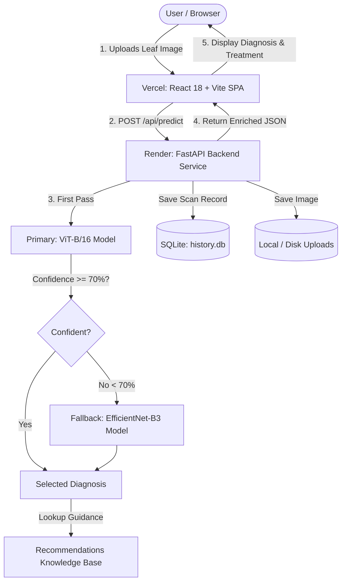

# 🌿 Crop Disease Detection Web App

<div align="center">

[](https://www.python.org/)
[](https://fastapi.tiangolo.com/)
[](https://pytorch.org/)
[](https://react.dev/)
[](https://www.typescriptlang.org/)
[](https://vitejs.dev/)
[](https://tailwindcss.com/)
[](https://vercel.com/)
[](https://render.com/)

**An end-to-end, AI-powered agricultural diagnosis platform.** Photograph any crop leaf, receive an instant disease diagnosis powered by a two-model deep learning cascade (Vision Transformer + EfficientNet-B3), and access practical, expert-backed treatment guidelines across 91 crop disease classes.

[Features](#-key-features) • [Architecture](#-system-architecture) • [Live Deployment](#-deployment-guide) • [Local Setup](#-local-development-setup) • [API Docs](#-api-reference) • [Credits](#-author--credits)

</div>

---

## 📋 Table of Contents

- [🌿 Overview](#-overview)
- [✨ Key Features](#-key-features)
- [🏗️ System Architecture](#-system-architecture)
- [🚀 Deployment Guide](#-deployment-guide)
  - [Deploying Frontend on Vercel](#1-deploy-frontend-on-vercel)
  - [Deploying Backend on Render](#2-deploy-backend-on-render)
- [💻 Local Development Setup](#-local-development-setup)
  - [Prerequisites](#prerequisites)
  - [Backend Setup (FastAPI)](#step-1-backend-setup)
  - [Frontend Setup (React + Vite)](#step-2-frontend-setup)
- [🧪 Running Test Suites](#-running-test-suites)
- [📡 API Reference](#-api-reference)
- [🧠 Model Checkpoints & Data](#-model-checkpoints--data)
- [👤 Author & Credits](#-author--credits)

---

## 🌿 Overview

Crop diseases cause substantial losses to agricultural yield and food security every year. This platform bridges advanced computer vision research and real-world farm management by providing:

1. **High-Accuracy Computer Vision**: A cascade of **ViT-B/16** (Vision Transformer, 384px) as the primary classifier and **EfficientNet-B3** (300px) as the secondary fallback.
2. **Actionable Treatment Plans**: Detailed recommendations covering **Chemical treatments**, **Organic / Biological remedies**, **Cultural practices**, and **Preventative management**.
3. **Scan History Tracking**: Persistent history stored with SQLite and local image storage, including thumbnail previews and a one-click **"Delete All History"** management feature.
4. **Accessible Design**: Built in strict accordance with WCAG 2.1 AA standards, high-contrast palette pairings, screen reader announcements, and keyboard navigation.

---

## ✨ Key Features

- **🌾 Multi-Crop Support**: Detects diseases across Apple, Blueberry, Cherry, Corn, Grape, Orange, Peach, Bell Pepper, Potato, Raspberry, Soybean, Squash, Strawberry, Tomato, Cotton, and more.
- **⚡ Dual-Model Confidence Cascade**:
  - Primary: Vision Transformer (ViT-B/16 @ 384×384)
  - Fallback: EfficientNet-B3 (300×300) when confidence is below 70%
  - Automatically handles cross-architecture label vocabularies (91 classes) into canonical crop-disease pairs.
- **📸 Flexible Image Upload**: Drag-and-drop file upload, browse device files, or capture directly with device camera.
- **📄 Downloadable Reports**: Export comprehensive diagnosis results as printable, structured text reports.
- **🗂️ History Management**: Browse past scans with thumbnail previews, filter by scan dates, inspect full details, or clear all history with a secure modal confirmation.
- **♿ Inclusive Accessibility**: Full keyboard navigation, visible focus indicators, live regions for screen reader updates (`aria-live`), and respect for `prefers-reduced-motion`.

---

## 🏗️ System Architecture



---

## 🚀 Deployment Guide

This project is architected for seamless separation of concerns:
- **Frontend** is deployed to **Vercel** as a high-performance static React Single Page Application.
- **Backend** is deployed to **Render** as a Python FastAPI web service.

---

### 1. Deploy Frontend on Vercel

1. Push your repository to GitHub: `https://github.com/Dibendu094/CropDiseasesDetection.git`
2. Log in to [Vercel](https://vercel.com/) and click **Add New Project**.
3. Import the `CropDiseasesDetection` repository.
4. In the project configuration:
   - **Framework Preset**: `Vite`
   - **Root Directory**: Click *Edit* and select **`frontend`**.
   - **Build Command**: `npm run build`
   - **Output Directory**: `dist`
   - **Install Command**: `npm install`
5. Under **Environment Variables**, add:
   - `VITE_API_BASE_URL`: The URL of your deployed Render backend (e.g. `https://crop-disease-backend.onrender.com`).
6. Click **Deploy**. Vercel will automatically build and publish your frontend with SPA routing enabled via `frontend/vercel.json`.

---

### 2. Deploy Backend on Render

1. Log in to [Render](https://render.com/) and click **New +** → **Web Service**.
2. Connect your GitHub repository: `Dibendu094/CropDiseasesDetection`.
3. Configure the service:
   - **Name**: `crop-disease-backend`
   - **Region**: Select your nearest region (e.g. Frankfurt, Oregon, Singapore).
   - **Root Directory**: `backend`
   - **Runtime**: `Python 3`
   - **Build Command**:
     ```bash
     pip install -r requirements.txt
     ```
   - **Start Command**:
     ```bash
     uvicorn app.main:app --host 0.0.0.0 --port $PORT
     ```
4. Under **Environment Variables**, configure:
   - `PYTHON_VERSION`: `3.11.9`
   - `CORS_ALLOW_ORIGINS`: `*` (or your Vercel URL: `https://your-app.vercel.app`)
   - `MODELS_DIR`: `../models`
   - `DATA_DIR`: `../data`
5. **Model Checkpoints on Render**:
   - Because PyTorch checkpoints total ~1.1 GB, place or download `best_epoch_4_acc_98.70.pth` and `vit_b16_epoch_02 (2).pth` into the `models/` directory during build or attach a Render Persistent Disk.
   - *Note*: If deployed without checkpoints, the backend automatically enters degraded mode (`GET /api/health` reports status `degraded`), allowing metadata and history endpoints to serve normally.
6. Click **Create Web Service**. Render will install dependencies and launch Uvicorn.

---

## 💻 Local Development Setup

### Prerequisites

- **Python**: 3.11 or higher
- **Node.js**: 18.x or higher (v20+ recommended)
- **npm**: 9.x or higher
- **Git**

---

### Step 1: Backend Setup

```bash
# 1. Clone repository
git clone https://github.com/Dibendu094/CropDiseasesDetection.git
cd CropDiseasesDetection/backend

# 2. Create virtual environment
python -m venv .venv

# On Windows:
.\.venv\Scripts\Activate.ps1
# On macOS / Linux:
source .venv/bin/activate

# 3. Install dependencies
pip install -r requirements.txt

# 4. (Optional) Configure environment
copy .env.example .env

# 5. Run the FastAPI development server
python -m uvicorn app.main:app --reload --host 127.0.0.1 --port 8000
```

- **Backend API**: `http://127.0.0.1:8000`
- **Interactive Swagger Docs**: `http://127.0.0.1:8000/docs`
- **Alternative ReDoc**: `http://127.0.0.1:8000/redoc`

---

### Step 2: Frontend Setup

Open a second terminal window:

```bash
# 1. Navigate to frontend directory
cd CropDiseasesDetection/frontend

# 2. Install dependencies
npm install

# 3. Start Vite dev server with proxy
npm run dev
```

- **Frontend Application**: `http://localhost:5173`
- The Vite dev server automatically proxies `/api` calls to `http://127.0.0.1:8000`.

---

## 🧪 Running Test Suites

Both frontend and backend are covered by comprehensive unit, integration, and property-based test suites.

### Backend Tests (PyTest)

```bash
cd backend
python -m pytest tests
```
- **82 automated tests passing** (configuration validation, database persistence, batch history deletion, error envelopes, and recommendation resolution).

### Frontend Tests (Vitest & Testing Library)

```bash
cd frontend

# Run all unit and contract tests
npm test

# Run TypeScript static typecheck
npm run typecheck

# Run code linter
npm run lint

# Build production bundle
npm run build
```
- **53 automated tests passing** (WCAG contrast checks, layout verification, accessibility traps, confidence meters, and diagnosis reports).

---

## 📡 API Reference

| Method | Path | Description |
|---|---|---|
| `GET` | `/api/health` | Healthcheck & loaded model status (`healthy` / `degraded`) |
| `GET` | `/api/meta/classes` | Retrieve supported crops, diseases, and total class count |
| `POST` | `/api/predict` | Upload image (`multipart/form-data`) with optional crop filter |
| `GET` | `/api/history` | Paginated list of recent scans (newest first) |
| `GET` | `/api/history/{id}` | Detailed scan record with candidates & treatments |
| `GET` | `/api/history/{id}/image`| Raw leaf image stream for a scan |
| `DELETE` | `/api/history/{id}` | Delete a single scan and its image file |
| `DELETE` | `/api/history` | **Delete all history** scans and prune uploaded images |

---

## 🧠 Model Checkpoints & Data

The application uses two deep learning architectures trained on plant pathology datasets:

| Checkpoint File | Architecture | Input Size | Classes | Role |
|---|---|---|---|---|
| `vit_b16_epoch_02 (2).pth` | ViT-B/16 (timm) | 384×384 | 91 | Primary classifier |
| `best_epoch_4_acc_98.70.pth` | EfficientNet-B3 (timm) | 300×300 | 91 | Confidence fallback |

Checkpoints are placed in the `models/` directory. See [models/README.md](models/README.md) for architecture details, dataset mappings, and download instructions.

---

## 👤 Author & Credits

Developed and maintained exclusively by:

**Dibendu094**
- **GitHub**: [@Dibendu094](https://github.com/Dibendu094)
- **Repository**: [Dibendu094/CropDiseasesDetection](https://github.com/Dibendu094/CropDiseasesDetection)

---

<div align="center">
  <sub>Built with 🌿 for sustainable agriculture and plant health monitoring.</sub>
</div>
